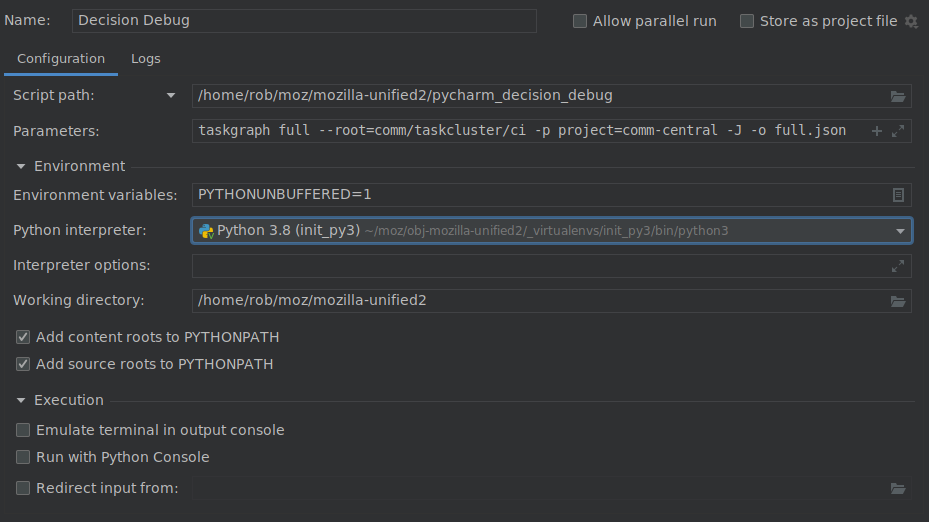

# Debugging Taskgraph Decision tasks in Pycharm

- Set up `mach python`'s virtual environment. (Python 3 these days)
    - `mach python`
- Copy `pycharm_decision_debug` into your project directory
- Install the Cython extension  to speed things up
- Set up a Run configuration in Pycharm.

- The Parameters are the same as `mach taskgraph `takes and are just passed onto mach.
- The interpreter has to point to the one created by `mach python`
- Working directory is top of source checkout

- Use your Run Configuration in "Debug" mode!

[pycharm_debug.webm](pycharm_debug.webm)

[pycharm_decision_debug.py](pycharm_decision_debug.py)